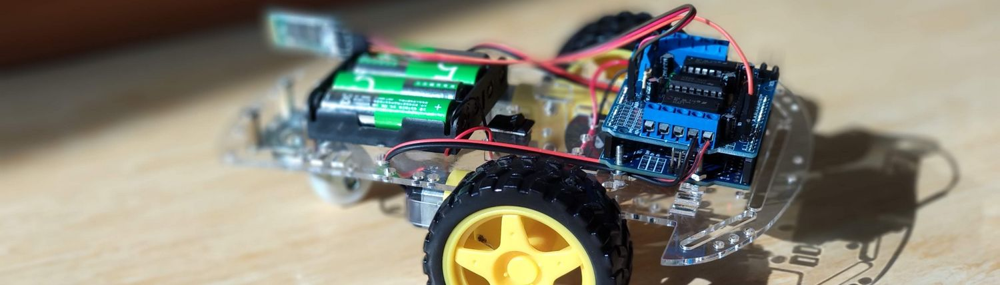
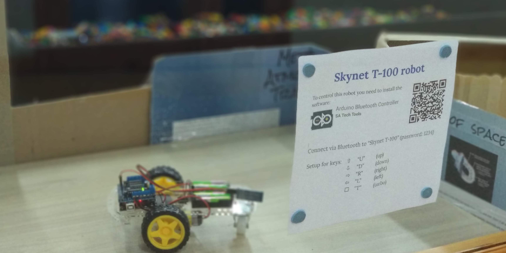

# T100 Arduino robot car with bluetooth control

This is our first working sample of a remotely controlled robot at the American International School Vietnam. It has been build in September 2018. That's how it looks:

The software for the Arduino is [T100.ino](T100.ino). Library and Android software are described further down.

## Materials

All materials were ordered at [CỬA HÀNG IC ĐÂY RỒI](https://icdayroi.com/). This is the list:

1. [Arduino UNO R3 DIP](https://icdayroi.com/arduino-uno-r3-dip) 110.000₫
2. [Khung Xe Robot](https://icdayroi.com/khung-xe-robot) 68.000₫
3. [Shield L293D motor arduino](https://icdayroi.com/shield-l293d-motor-arduino) 34.000₫
4. [Module thu phát bluetooth HC-05](https://icdayroi.com/module-thu-phat-bluetooth-hc-05) 80.000₫
5. Four 10 cm cable 0.25 mm² to connect the motors to the shield
6. Three female-male jumper wire to connect the bluetooth module to the Arduino (+3.3V, GND, RX)
7. So in general: some [jumper wires](https://icdayroi.com/bo-day-cam-test-board-65-soi) 19.000₫
8. Maybe [a breadboard](https://icdayroi.com/testboard-mini-syb-170) to connect 5.000₫

## Building steps

* Assemble the robot
* Connect the motors to M1 and M4 on the L293D shield
* Add the AFMotor.h motor library (library/AFMotor.zip) in the Arduino IDE
* Upload the program [T100.ino](T100.ino) to your Arduino Uno
* Install the software [Arduino Bluetooth Controller](https://play.google.com/store/apps/details?id=com.satech.arduinocontroller) to your Android phone
* Connect to the bluetooth module of the robot
* Configure the keys of the remote the following:
  - "U" for up
  - "D" for down
  - "L" for left
  - "R" for right
  
Your result should work:

## Limitations

The bluetooth module HC-05 (as well as HC-06) are only Bluetooth 2.0 and don't work with iOS, since iOS requires Bluetooth 4.0 Low Energy (BLE). We created the T-110 with the AR-06 BLE (Bluetooth Low Energy - Bluetooth 4.0) module. This project is [described here as T110](../../T110).

## Further details

Details, instructions and pictures can be found in the [Wiki](https://github.com/kreier/T100/wiki). 
