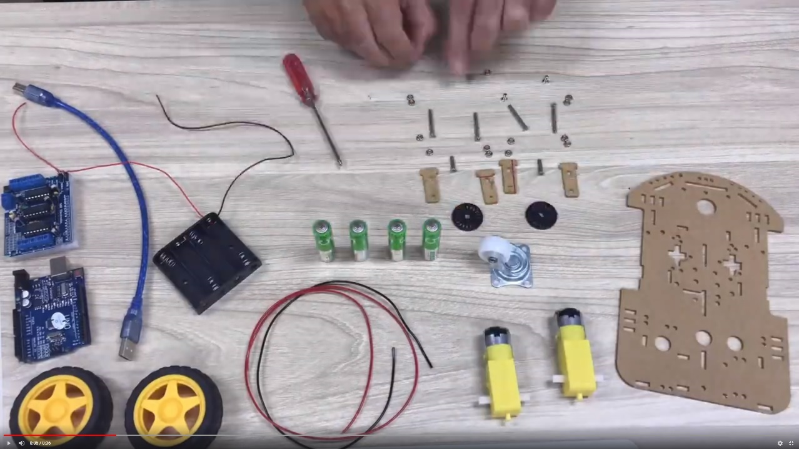

# T100 Arduino robot car with bluetooth control

[](https://GitHub.com/kreier/T100/releases/)
[](https://kreier.mit-license.org/)
[](https://travis-ci.com/kreier/T100)

This is our first working sample of a remotely controlled robot at the American International School Vietnam. It has been build in September 2018. That's how it looks:


The software for the Arduino is [T100.ino](T100.ino). Library and Android software are described further down.

## Materials

All materials were ordered at [CỬA HÀNG IC ĐÂY RỒI](https://icdayroi.com/). This is the list:

1. [Arduino UNO R3 DIP](https://icdayroi.com/arduino-uno-r3-dip) 110.000₫
2. [Khung Xe Robot](https://icdayroi.com/khung-xe-robot) 68.000₫
3. [Shield L293D motor arduino](https://icdayroi.com/shield-l293d-motor-arduino) 34.000₫
4. [Module thu phát bluetooth HC-05](https://icdayroi.com/module-thu-phat-bluetooth-hc-05) 80.000₫
5. Four 10 cm cable 0.25 mm² to connect the motors to the shield
6. Three female-male jumper wire to connect the bluetooth module to the Arduino (+3.3V, GND, RX)
7. So in general: some [jumper wires](https://icdayroi.com/bo-day-cam-test-board-65-soi) 19.000₫
8. Maybe [a breadboard](https://icdayroi.com/testboard-mini-syb-170) to connect 5.000₫

## Building steps

* Assemble the robot
* Connect the motors to M1 and M4 on the L293D shield
* Add the AFMotor.h motor library (library/AFMotor.zip) in the Arduino IDE
* Upload the program [T100.ino](T100.ino) to your Arduino Uno
* Install the software [Arduino Bluetooth Controller](https://play.google.com/store/apps/details?id=com.appsvalley.bluetooth.arduinocontroller) to your Android phone (old [link from 2018](https://play.google.com/store/apps/details?id=com.satech.arduinocontroller) no longer works in 2024)
* Connect to the bluetooth module of the robot
* Configure the keys of the remote the following:
  - "U" for up
  - "D" for down
  - "L" for left
  - "R" for right
  
Your result should work:


## Limitations

The bluetooth module HC-05 (as well as HC-06) are only Bluetooth 2.0 and don't work with iOS, since iOS requires Bluetooth 4.0 Low Energy (BLE). We created the T-110 with the AR-06 BLE (Bluetooth Low Energy - Bluetooth 4.0) module. This project is [described here as T110](../../../T110).

## Video about build in 30 seconds

I uploaded [a timelapse video](https://youtu.be/CzpAYpl62GI) about the creation of this robot in 30 seconds. It took 2 hours.

[](https://youtu.be/CzpAYpl62GI)

## Code


```cpp
#include <AFMotor.h> // download from subdirectory 'library' here and install zip file
#include <SoftwareSerial.h>

#define LED_PIN 13
 
AF_DCMotor motor1(1, MOTOR12_64KHZ); // create motor #1, 64KHz pwm
AF_DCMotor motor4(4, MOTOR12_64KHZ); // create motor #2, 64KHz pwm
SoftwareSerial BTSerial(A0, 3);   // RX | TX  -  pin 2 creates errors on my motor shield, analog pin is fine ...
char BTinput = '0';
byte speed = 200;

void setup() {
  motor1.setSpeed(100);
  motor4.setSpeed(100);     // set the speed to 200/255
  BTSerial.begin(9600);  // HC-10 default speed
  Serial.begin(57600);   // just to check while programming
}
 
void loop() {
  if (BTSerial.available()) 
  {
    BTinput = BTSerial.read();
    if (BTinput == 'A')// up
    {
      motor1.run(FORWARD);
      motor4.run(FORWARD);
    }
    if (BTinput == 'C')// down
    {
      motor1.run(BACKWARD);
      motor4.run(BACKWARD);
    }
    if (BTinput == 'D')// left
    {
      motor1.run(FORWARD);
      motor4.run(BACKWARD);
    }
    if (BTinput == 'B')// right
    {
      motor1.run(BACKWARD);
      motor4.run(FORWARD);
    }      
    if (BTinput == 'G')  // that's the "X" key
    {
      motor1.run(RELEASE);      // stopped
      motor4.run(RELEASE);
    }
    if (BTinput == 'E')// faster - plus 10 - triangle
    {
      speed = speed + 10;
    }
    if (BTinput == 'H')// slower - minus 10 - square
    {
      speed = speed - 10;
    } 
    if (BTinput == 'F')// maximum speed - circle
    {
      speed = 255;
    }
    if( speed > 255 ) speed = 255;
    motor1.setSpeed(speed);
    motor4.setSpeed(speed);
    Serial.print("recieved: ");
    Serial.print( BTinput );
    Serial.print(" speed: ");
    Serial.println( speed );
  }
}
```


## Further details

Details, instructions and pictures can be found in the [Wiki](https://github.com/kreier/T100/wiki). 
